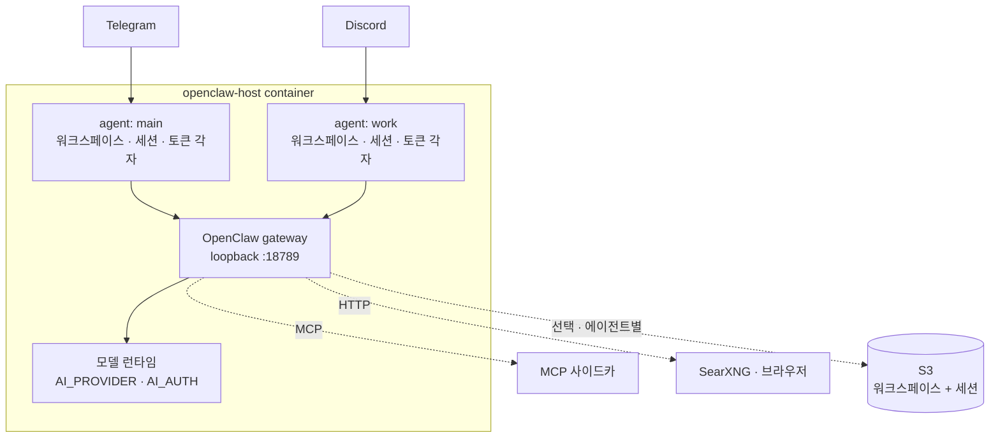

# openclaw-host

> English: [`README.md`](README.md)

[OpenClaw](https://docs.openclaw.ai)를 내 소유의 머신 — 홈서버, VPS, 남는 PC —
에서 상시 서비스로 돌린다. 네이티브 채팅 채널, 격리된 다중 에이전트, 선택적 S3
상태 동기화까지.

다른 데서 구하기 어려운 부분: **설치된 OpenClaw 버전이 받아들이는 설정 모양을
만들어낸다.** OpenClaw 2026.8.1("2.0")이 그 모양을 바꿨는데 **양방향 모두 하드
에러**라, 버전을 올리든 되돌리든 게이트웨이가 아예 안 뜨는 상황이 된다. 이
호스트는 부팅 때 `openclaw --version`을 읽고 거기 맞춘다.
[`docs/versions.md`](docs/versions.md) 참고.

> 상태: 홈서버에서 프로덕션 운영 중 — Telegram + Discord, 격리된 에이전트 3개,
> 테스트 106개 통과. 설계는 [`docs/spec.md`](docs/spec.md).
> 시간을 실제로 잡아먹은 실패들 — 변경 감지 없는 백업이 만든 **하루 $20 S3
> 청구서** 포함 — 은 [`docs/troubleshooting.md`](docs/troubleshooting.md)에 있다.

## 실행

```bash
git clone git@github.com:wooogy-hq/openclaw-host.git
cd openclaw-host
cp .env.example .env      # DATA_BUCKET, USER_ID, TELEGRAM_BOT_TOKEN, AI_PROVIDER, …
bash run.sh               # docker build + graceful stop + docker run
docker logs -f openclaw-host
```

`run.sh`가 워크스페이스·상태·스킬 디렉터리를 바인드 마운트한다. 파일 상단의
경로를 네 머신에 맞게 고쳐라. [`docker-compose.yml`](docker-compose.yml)은 같은
컨테이너 이름·마운트·uid를 쓰는 선언형 등가물이라 둘 중 뭘 쓰든 같은 상태에
붙는다. systemd 유닛은 [`deploy/`](deploy/)에 있다.

Docker 없이 돌리려면 `npm install && npm run build && npm start` — `openclaw`
CLI가 PATH에 있거나 `OPENCLAW_BIN`이 가리키고 있어야 한다.

**범위.** 에이전트는 명령을 **컨테이너 안에서** 실행한다. 마운트된 호스트
디렉터리는 자유롭게 다루지만 호스트의 서비스·패키지·Docker에는 닿지 않는다.
그걸 열어주는 것(privileged, `--pid=host`, docker 소켓)은 컨테이너를 사실상
박스의 root로 만드는 일이니, 의도적으로 하거나 아예 하지 마라.

## 설정

전부 환경변수다 — [`.env.example`](.env.example) 참고. 시크릿은 env로만 전달되며
`openclaw.json`에는 **절대** 기록되지 않는다.

`openclaw.json`은 매 부팅 재생성된다. `gateway`·`channels`·`agents`는 호스트
소유이고 나머지(`mcp`, `bindings`, `auth`)는 얕은 병합으로 보존된다. 그래서
`openclaw agents add`는 남지만 `openclaw channels add`는 다음 부팅에 덮이므로
env로 넣어야 한다.

> ⚠️ [`Dockerfile`](Dockerfile)의 `OPENCLAW_VERSION` 핀은 의도적이다. 이 레포
> 히스토리의 모든 버전 상향은 각각 특정 고장을 고친 것이다. 호스트가 버전 간
> 설정 모양을 맞춰주긴 하지만, 어떤 게이트웨이를 돌릴지 고르는 지점은 여전히 이
> 핀이다. 올리기 전에 [`docs/versions.md`](docs/versions.md)를 읽어라.

## 에이전트와 채널

게이트웨이 하나에 **격리된 에이전트 N개** — 각자 워크스페이스·세션 기록·정체성·
GitHub 토큰을 따로 갖는다. 채널은 바인딩으로 에이전트에 연결된다:

```bash
openclaw agents add work --workspace /data/workspace-work
openclaw agents bind --agent work --bind discord   # discord → work; telegram 은 기본 유지
```

두 가지가 발목을 잡는다. 둘 다 [`docs/troubleshooting.md`](docs/troubleshooting.md)에
있다 — 바인딩은 게이트웨이를 재시작해야 적용되고, 새 워크스페이스는 `run.sh`에서
호스트 바인드 마운트여야 한다.

**자격증명도 에이전트별로 격리되는데, 기준은 작업 디렉터리다.** 각 에이전트는
자기 워크스페이스 트리를 갖고 git은 그 안에서 credential helper를 실행한다. 그래서
[`bin/git-credential-oc`](bin/git-credential-oc)는 **호출자가 어디 있는지**로
토큰을 고르지, 무엇을 요청했는지로 고르지 않는다. 다른 에이전트의 조직 경로를
요청해도 그 토큰을 얻을 수 없다는 뜻이다. REST 호출에는 helper 훅이 없으므로
[`bin/gh-api`](bin/gh-api)가 같은 라우팅을 적용한다.

## 프로바이더와 모델

`AI_PROVIDER`가 두뇌를 고른다 — `anthropic`, `bedrock`, `deepseek`, `openai`,
또는 env로 완전히 기술되는 커스텀 OpenAI/Anthropic 호환 엔드포인트
(`AI_BASE_URL` + `AI_MODEL` + `AI_OPENCLAW_API`). `AI_AUTH`가 인증 방식을 고른다:
`key`, `oauth`, `aws-sdk`.

`AI_PROVIDER=openai` + `AI_AUTH=oauth`면 토큰당 API 과금 대신 ChatGPT 구독
프로필로 OpenClaw 내장 Codex app-server를 통해 턴을 실행한다
(`openclaw models auth login --provider openai --device-code`). 자격증명은
에이전트별 auth 저장소에 있고 `openclaw.json`에도 S3에도 가지 않는다.

> 한 프로바이더에 프로필이 둘인데 순서를 안 정하면 OpenClaw가 **라운드로빈**
> 한다 — 할당량이 소진된 쪽까지 포함해서. 고정해라:
> `openclaw models auth order set --agent <id> --provider openai <profile…>`

## 확장

| | 방법 | 비고 |
|---|---|---|
| **스킬** | `install-skill add <owner/repo>` | 영속 `/skills` 볼륨에 설치 — 재빌드·재배포 불필요. `.claude-plugin/plugin.json` 필요. |
| **원격 MCP** | `openclaw mcp add <name> --transport streamable-http --url <url>` | 로컬에 띄울 게 없다. |
| **자체 호스팅 MCP** | [`run-mcp-sidecar.sh`](run-mcp-sidecar.sh) | 에이전트 컨테이너는 Node 전용이라 서버는 공유 `oc-net` 네트워크의 사이드카로 돌고 컨테이너 이름으로 접근한다. 예시: [`examples/mcp-sidecars/`](examples/mcp-sidecars/). |
| **웹 검색** | `SEARXNG_BASE_URL=http://searxng:8080` | 내장 `web_search` 도구의 백엔드. `settings.yml`에 `search.formats: [html, json]`이 켜져 있어야 한다. |
| **브라우저** | `BROWSER_URL=…` + `BROWSER_PASSWORD` | JS 렌더링 페이지·스크린샷, 사람이 실시간으로 볼 수 있다. 프로필이 named volume에 남아서 **사람이 한 번 로그인하면 에이전트가 그 세션을 재사용**한다 — 계정을 넘겨주는 것보다 낫다. ⚠️ `/exec`는 `oc-net`에서 도달 가능한 임의 코드 실행이다. 게이트 없이 뷰어를 공개하지 마라. |

사이드카는 [`docker-compose.sidecars.yml`](docker-compose.sidecars.yml)에
선언돼 있다. env 변수를 넣고 `run.sh`를 다시 돌리면 에이전트가 인식한다.

## 아키텍처



`src/index.ts`가 생명주기다 — 게이트웨이 버전 감지 → S3 복원 → `openclaw.json`
작성 → `openclaw gateway run` 감독 → 타이머와 종료 시 백업.
[`src/openclaw-compat.ts`](src/openclaw-compat.ts)가 버전 차이를,
[`src/host.ts`](src/host.ts)가 백업 대상을 담당한다.

S3 동기화는 에이전트별이고 디스크의 에이전트 디렉터리에서 유도되므로, 새 에이전트를
추가해도 코드를 고칠 필요가 없다. 프로바이더 auth 저장소는 그 디렉터리 옆에 있고
**절대** 업로드되지 않는다. `BACKUP_ENABLED=false`면 완전히 머신 로컬로 돈다.

> OpenClaw 2026.8.1부터 대화 기록이 에이전트별 SQLite로 들어가는데 그 파일이
> OAuth 저장소도 함께 담는다. 즉 파일 단위 세션 동기화는 자격증명을 같이 올리지
> 않고는 불가능해진다. 호스트는 그 버전에서 세션 프리픽스를 제외하고 부팅 때 그
> 사실을 알린다. 대신 `openclaw backup sqlite`를 써라. 자세한 건
> [`docs/versions.md`](docs/versions.md).

## 범위

**이것이다:** 설정 생성, 버전 호환, 에이전트별 자격증명 격리, 선택적 S3 상태
동기화를 갖춘 OpenClaw 프로세스 감독자.

**이것이 아니다:** 서버리스 스택. API Gateway도 Lambda도 DynamoDB도 없다.

[`src/s3-contract.ts`](src/s3-contract.ts)의 S3 레이아웃은 같은 버킷을 쓰는
`serverless-openclaw` 배포와 호환되도록 의도적으로 맞춰져 있다 —
`workspaces/{userId}/…`, `sessions/{userId}/agents/{agentId}/sessions/…`.
그런 배포와 버킷을 공유하지 않는다면 이 제약은 아무 비용도 아니다. 네
`DATA_BUCKET`을 쓰거나 백업을 아예 끄면 된다.

## 라이선스

MIT — [`LICENSE`](LICENSE) 참고.
