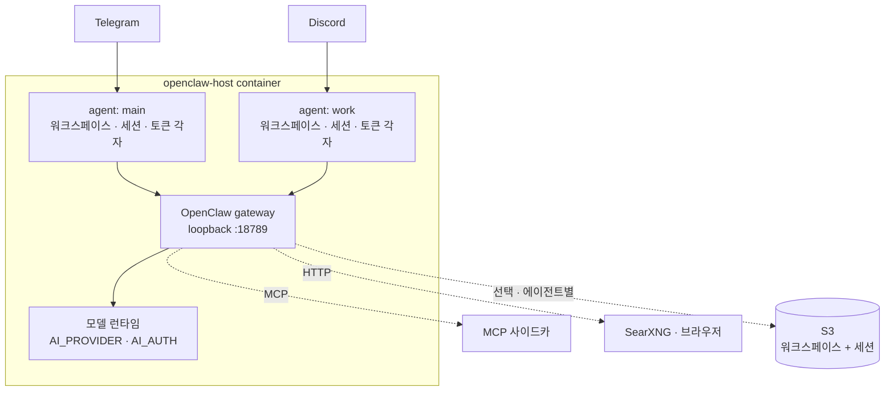

# openclaw-host

> English: [`README.md`](README.md)

[OpenClaw](https://docs.openclaw.ai)를 내가 소유한 하드웨어에서 상시 서비스로
돌린다. 홈서버, VPS, 서랍 속 남는 노트북. 네이티브 채팅 채널과 격리된 에이전트
여러 개를 쓰고, OpenClaw가 발밑에서 모양을 바꿔도 계속 뜨는 설정 계층을 얻는다.

```bash
git clone git@github.com:wooogy-hq/openclaw-host.git
cd openclaw-host && cp .env.example .env
bash run.sh
```

## 왜 만들었나

OpenClaw는 이미 자기를 서비스로 설치한다. `openclaw daemon install`이 systemd를
깔아주고 공식 Docker 이미지도 있다. 대부분은 거기서 끝내면 된다. 그걸 써라.

나를 거기서 밀어낸 건 세 가지다.

**설정이 재현 불가능해졌다.** OpenClaw는 대화형 마법사로 자기를 설정하고
`openclaw.json`을 쓴다. 그 파일은 시간이 지나며 표류한다. 6주 뒤에 보면 어떤
키를 내가 골랐고, 어떤 걸 마법사가 추측했고, 어떤 걸 자는 사이 `doctor`가
고쳤는지 말할 수 없다. 이 호스트는 매 부팅에 그 파일 전체를 환경변수에서
만들어낸다. 그래서 고칠 것도 백업할 것도 `.env` 하나다.

**버전 하나 올렸다가 게이트웨이가 죽었다.** OpenClaw 2026.8.1이 에이전트 로스터
키를 `agents.list`에서 `agents.entries`로 바꿨다. 양방향 모두 하드 에러다. 구
게이트웨이는 새 키를 거부하고 새 게이트웨이는 옛 키를 거부한다. 공식 해법인
`openclaw doctor --fix`는 확인을 요구한다. 컨테이너 안엔 답할 사람이 없고
`--non-interactive`는 하필 그 마이그레이션을 건너뛴다. 그래서 이 호스트는 부팅
때 `openclaw --version`을 읽고 그 버전이 받는 모양을 양방향으로 쓴다. 업그레이드는
리빌드 한 번. 롤백도 리빌드 한 번.

**에이전트 둘이 GitHub 토큰 하나를 공유했다.** 텔레그램에 개인 에이전트,
디스코드에 동료도 말을 거는 업무 에이전트를 돌린다. OpenClaw는 워크스페이스,
세션, 모델 자격증명을 격리해주지만 git이 보는 토큰은 하나다. 레포 경로를
요청하면 그 토큰이 닿는 무엇이든 돌아온다. 여기서는 credential helper가 호출자가
서 있는 작업 디렉터리로 토큰을 고른다. 업무 에이전트가 개인 레포 이름을 대도 못
읽는다.

셋 다 남 얘기라면 `openclaw daemon install`이 너와 업스트림 사이에 낀 게 더 적다.

## 구조



[`src/index.ts`](src/index.ts)가 생명주기를 돌린다. 게이트웨이 버전 읽기, S3
복원, `openclaw.json` 작성, `openclaw gateway run` 감독, 타이머와 종료 시 백업.
버전 차이는 [`src/openclaw-compat.ts`](src/openclaw-compat.ts)가, 백업 범위는
[`src/host.ts`](src/host.ts)가 담당한다.

## 설정하기

`.env`를 채운다. 모든 설정이 거기 있고, `run.sh`와 `docker-compose.yml`이 읽는
경로도 같은 파일에서 온다. 그래서 둘이 상태 위치를 다르게 알 일이 없다.

```bash
DATA_BUCKET=my-bucket          # 또는 BACKUP_ENABLED=false 로 머신 로컬만
USER_ID=me
TELEGRAM_BOT_TOKEN=…
AI_PROVIDER=openai             # anthropic | bedrock | deepseek | openai | 커스텀
AI_AUTH=oauth                  # key | oauth | aws-sdk
HOST_WORKSPACE=/srv/oc/workspace   # 기본값 $HOME/openclaw-workspace
```

그리고 `bash run.sh`. 이미지를 빌드하고, 마지막 백업이 끝나도록 150초 유예를 주며
옛 컨테이너를 멈추고, 새 것을 띄운다. [`docker-compose.yml`](docker-compose.yml)이
같은 일을 선언형으로 하고, Docker 없이 돌릴 systemd 유닛은 [`deploy/`](deploy/)에
있다.

에이전트는 명령을 컨테이너 안에서 실행한다. 마운트된 호스트 디렉터리 아래는
마음대로 고치지만 호스트의 서비스, 패키지, Docker에는 닿지 못한다. 그걸 열어주는
선택(privileged, `--pid=host`, docker 소켓)은 컨테이너를 박스의 root로 만든다.
하기 전에 결정해라.

### 에이전트 하나 더

```bash
openclaw agents add work --workspace /data/workspace-work
openclaw agents bind --agent work --bind discord
```

먼저 `.env`에 `HOST_WORKSPACE_WORK`를 넣어라. 이미지 안에서 `/data`는 root
소유라, 바인드 마운트 없는 워크스페이스를 받은 에이전트는 쓰지도 못하고
컨테이너와 함께 죽는다. 바인딩도 게이트웨이를 재시작해야 먹는다. 두 함정과 거기
쓴 시간은 [`docs/troubleshooting.md`](docs/troubleshooting.md)에 있다.

### 모델 고르기

`AI_PROVIDER=openai` + `AI_AUTH=oauth`면 토큰당 API 과금 대신 ChatGPT 구독으로
OpenClaw 내장 Codex app-server를 통해 턴을 돌린다.

```bash
openclaw models auth login --provider openai --device-code
```

자격증명은 에이전트별 auth 저장소에 남는다. `openclaw.json`에도 S3에도 가지 않는다.

> 한 프로바이더에 프로필이 둘인데 순서를 안 정하면 OpenClaw가 라운드로빈 한다.
> 할당량이 소진된 쪽까지 포함해서. 고정해라:
> `openclaw models auth order set --agent <id> --provider openai <profile…>`

### 에이전트에게 도구 주기

| | 방법 | 알아둘 것 |
|---|---|---|
| **스킬** | `install-skill add <owner/repo>` | 영속 `/skills` 볼륨에 설치된다. 재빌드 없음. `.claude-plugin/plugin.json`이 필요하다. |
| **원격 MCP** | `openclaw mcp add <name> --transport streamable-http --url <url>` | 로컬에 띄울 게 없다. |
| **자체 호스팅 MCP** | [`run-mcp-sidecar.sh`](run-mcp-sidecar.sh) | 에이전트 컨테이너엔 Node 말고 아무것도 없다. 서버는 `oc-net` 네트워크의 사이드카로 돌고 컨테이너 이름으로 답한다. 동작하는 예시는 [`examples/mcp-sidecars/`](examples/mcp-sidecars/). |
| **웹 검색** | `SEARXNG_BASE_URL=http://searxng:8080` | 내장 `web_search` 도구의 백엔드다. `settings.yml`에 `search.formats: [html, json]`을 켜지 않으면 검색이 전부 실패한다. |
| **브라우저** | `BROWSER_URL=…` + `BROWSER_PASSWORD` | JS 렌더링 페이지, 스크린샷, 사람이 지켜볼 수 있는 뷰어. 프로필이 named volume에 남아서 사이트에 한 번 로그인하면 에이전트가 그 세션을 재사용한다. 비밀번호를 넘기는 것보다 낫다. `/exec`는 `oc-net`에서 임의 코드를 실행하니 뷰어는 게이트 뒤에 둬라. |

## OpenClaw 올리기

`.env`의 `OPENCLAW_VERSION`을 바꾸고 리빌드, 재시작. 호스트가 발견한 버전에
맞춰 `openclaw.json`을 다시 쓰고 바꾼 내용을 전부 로그에 남긴다. 2026.9로
넘어갈 땐 Node 베이스 이미지도 새로 해야 한다. OpenClaw가 이제 Node 22에서
설치를 거부하기 때문이다.

[`docs/versions.md`](docs/versions.md)에 릴리스 사이에 뭐가 움직였는지, 어떤
차이가 진짜고 어떤 둘이 진짜처럼 보이지만 아닌지 적어뒀다. CI가 그걸 증명한다.
한 잡이 `openclaw@latest`를 설치하고, 2026.7 모양 픽스처를 호환 계층에 통과시킨
뒤, 진짜 바이너리에게 결과를 검증시킨다. 업스트림이 또 모양을 바꾸면 네
게이트웨이의 다음 부팅이 아니라 여기서 깨진다.

세션 기록은 2026.8.1부터 에이전트별 SQLite로 들어갔다. 그 파일이 OAuth 저장소도
함께 담아서, 파일 단위 세션 동기화는 refresh 자격증명을 S3로 밀게 된다. 호스트는
그 버전에서 세션 프리픽스를 빼고, 부팅 때 그 사실을 알리고,
`openclaw backup sqlite`를 가리킨다.

## 다른 도구와 비교

### 어디서 나왔나

이건 [`serverless-openclaw`](https://github.com/serithemage/serverless-openclaw)
(★195)에서 AWS를 덜어낸 것이다. 그 프로젝트는 같은 에이전트를 Lambda, Fargate
Spot, API Gateway, Cognito, DynamoDB, S3, CloudFront, CloudWatch, EventBridge에
걸쳐 온디맨드로 돌린다. 유휴 용량을 소유하지 않아 월 $0.01 수준까지 내려가고,
`cdk deploy` 한 번으로 배포되며 콜드 스타트가 1.35초다.

나는 놀고 있는 홈서버가 이미 있었다. 관리형 서비스 아홉 개가 사줄 게 없었다는
뜻이다. 남긴 건 [`src/s3-contract.ts`](src/s3-contract.ts)의 S3 레이아웃
하나다. 바이트 단위로 같게 유지해서 둘이 버킷을 공유하고 서로의 상태를 본다.
버린 건 나머지 전부다. Lambda 없고, API Gateway 없고, DynamoDB도 Cognito도 CDK도
React 웹 UI도 없다. UI 자리는 OpenClaw 자체 Telegram·Discord 채널이, 컴퓨트
자리는 컨테이너가, 인프라 자리는 1500줄짜리 TypeScript 서비스가 대신한다.

머신이 없고 청구서를 0에 수렴시키고 싶으면 serverless-openclaw를 골라라. 머신이
있고 콜드 스타트도 AWS 콘솔도 없이 에이전트 파일을 `ls`로 볼 수 있는 디스크에
두고 싶으면 이걸 골라라.

### OpenClaw 돌리는 방법들

| | 별 | 이걸 고를 때 |
|---|---:|---|
| [`openclaw daemon install`](https://docs.openclaw.ai/cli/gateway) | - | 한 번 손으로 설정하고 그대로 둔다. **여기서 시작해라.** |
| [공식 Docker 이미지](https://docs.openclaw.ai/install/docker) | - | 컨테이너는 원하고 대화형 마법사도 괜찮다 |
| [Railway](https://railway.com/deploy/openclaw-prev-clawdbot-moltbot-self-host), Coolify, Elest.io | - | 머신을 소유하고 싶지 않다 |
| [serverless-openclaw](https://github.com/serithemage/serverless-openclaw) | 195 | 머신이 없고 유휴 비용이 0이어야 한다 |
| **openclaw-host** | - | 설정이 재현돼야 하고, 에이전트 여럿이 각자 자격증명을 쓰고, OpenClaw 버전을 오갈 예정이다 |

### OpenClaw에 묶이지 않았다면

더 큰 프로젝트들이 옆 문제를 푼다. 다만 [OpenClaw](https://github.com/openclaw/openclaw)
(★389k)를 호스팅하는 게 아니라 자기 에이전트를 돌린다. 갈아타면 OpenClaw의 채널,
스킬, MCP 배선을 두고 가야 한다.

| | 별 | 무엇인가 |
|---|---:|---|
| [LobeHub](https://github.com/lobehub/lobehub) | 82.5k | 에이전트 여럿을 7×24로 운영, 운영 UI 제공 |
| [Agent Zero](https://github.com/agent0ai/agent-zero) | 19.2k | 파이썬으로 확장하는 범용 에이전트 프레임워크 |
| [LangBot](https://github.com/langbot-app/LangBot) | 17.8k | Discord·Telegram 내장 IM 봇 플랫폼, 플러그인, RAG |

### 내장 서비스와 직접 비교

| | `daemon` / 공식 Docker | openclaw-host |
|---|---|---|
| 상시 가동, 죽으면 재시작 | 됨 | 됨 |
| 대화형 온보딩 | 한 번 필요 | 없음. `openclaw.json`이 매 부팅 env에서 나온다 |
| 버전 상향, 롤백 | `doctor --fix`가 묻고, `--non-interactive`는 컨테이너가 답할 수 없는 설정 마이그레이션을 건너뛴다 | 설치된 버전에 맞춰 양방향으로 작성 |
| 에이전트별 자격증명 | 모델 auth는 에이전트별, git과 GitHub은 공유 | git 토큰이 작업 디렉터리로 라우팅된다 |
| 머신 밖 상태 | `openclaw backup`: git 레포, SQLite 스냅샷 | 그것에 더해 serverless-openclaw와 공유 가능한 S3 미러 |
| 검색, 브라우저 사이드카 | 직접 배선 | 선언돼 있고 실패 양상까지 적혀 있다 |
| 공식 지원 | 있음 | 없음. 개인 홈서버 산출물, MIT, 무보증 |

## 상태

홈서버에서 실운영 중이다. Telegram과 Discord, 격리된 에이전트 3개, 테스트 111개,
CI 그린. 설계는 [`docs/spec.md`](docs/spec.md)에 있다. 내 시간을 실제로 잡아먹은
실패들은, 변경 감지 없는 백업이 만든 하루 $20 S3 청구서를 포함해
[`docs/troubleshooting.md`](docs/troubleshooting.md)에 있다.

## 라이선스

MIT. [`LICENSE`](LICENSE) 참고.
