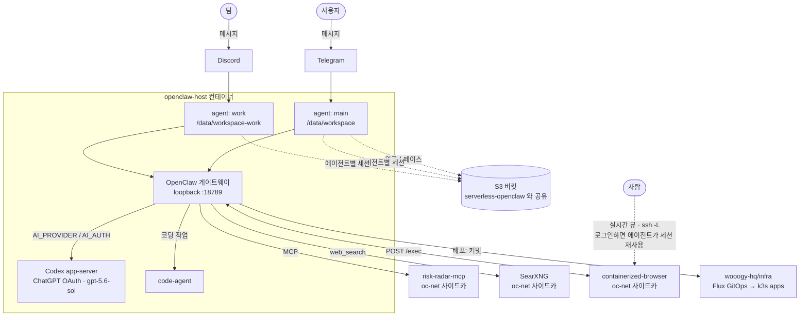

# openclaw-host

> English: [`README.md`](README.md)

머신에 상주하는 독립 **OpenClaw** 런타임 + **S3 상태 동기화**.

집 서버·VPS·남는 PC 아무거나 상시 가동 OpenClaw 에이전트 호스트로 만든다.
OpenClaw의 **네이티브 채널**(Telegram, Discord)을 직접 물고, 워크스페이스와 세션
상태를 [`serverless-openclaw`](https://github.com/serithemage/serverless-openclaw)
배포와 **같은 S3 버킷**에 미러링한다 — 머신 경로와 서버리스 웹/텔레그램 경로가
같은 상태를 본다.

> 상태: 집 서버에서 실운영 중 — Telegram + Discord, 격리된 에이전트 2개, 테스트 79개
> 통과. 설계는 [`docs/spec.md`](docs/spec.md), 실제로 시간을 잡아먹은 장애들은
> [`docs/troubleshooting.md`](docs/troubleshooting.md)에 있다.

> 💸 **비싸게 배운 비용 교훈.** 주기적 S3 백업이 원래는 변경 감지 없이 워크스페이스
> **전체**를 매 사이클 재업로드했다. 에이전트가 리포 몇 개를 클론하고 나니 워크스페이스가
> 약 32,000개 파일이 됐고 — **그중 ~85%가 `node_modules/`와 `.git/`** — 백업이 쉬지 않고
> 돌면서 **하루 약 450만 건의 S3 PUT/LIST 요청(약 $20/일, AWS 비용 이상 알림)**이
> 발생했다. 클론이 늘수록 커지는 구조였다. 실제 청구서, 실제 고통.
> [`src/s3-sync.ts`](src/s3-sync.ts)에서 고쳤다: (1) `node_modules`/`.git`/빌드 캐시
> **및 중첩된 git 리포** 제외(클론은 원격에 있으니 에이전트 자체 상태만 백업),
> (2) 크기+mtime 매니페스트 기반 **증분** 업로드로 유휴 사이클의 PUT을 **0**으로.
> 결과: 450만 → 66만 → 사실상 0. 이 리포를 포크한다면 워크스페이스 백업을 가볍게
> 유지하고, 재생성 가능한 쓰레기를 S3에 절대 미러링하지 마라.

## 빠른 시작 (로컬)

```bash
git clone git@github.com:SeungWookHan/openclaw-host.git
cd openclaw-host
cp .env.example .env   # DATA_BUCKET, USER_ID, AWS_REGION, TELEGRAM_BOT_TOKEN, AI_PROVIDER... 설정
npm install
npm run build
npm start              # S3에서 복원 -> openclaw.json 작성 -> `openclaw gateway run` 실행
```

`openclaw` CLI가 PATH에 있어야 하고, **버전은 이 리포가 고정한 값**을 써야 한다 —
직접 고르지 말고 [`Dockerfile`](Dockerfile)의 `OPENCLAW_VERSION`을 읽어라(아래 핀 경고
참고). 특정 바이너리를 쓰려면 `OPENCLAW_BIN`으로 지정한다.

## 서비스로 운영하기 ("OS처럼")

에이전트는 호스트의 파일·프로젝트 디렉터리를 소유한다(files 스코프 — 컨테이너 안에서는
완전한 제어권, 호스트 접근은 마운트된 디렉터리로 한정. 호스트 서비스·패키지·docker는
건드릴 수 없다). 동등한 두 경로가 있다:

**`run.sh` — 집 서버의 주 배포 수단.** 이미지를 빌드하고 워크스페이스/상태/스킬을
바인드 마운트해 컨테이너를 (재)기동한다:

```bash
bash run.sh                 # docker build + graceful stop -t 150 + docker run
docker logs -f openclaw-host
```

**docker compose — `run.sh`의 선언적 등가물** (컨테이너 이름·바인드 경로·env·uid가
동일). 어느 쪽으로 띄워도 **같은 상태**에 붙으므로 유실이 없다:

```bash
docker compose up -d --build      # HOST_WORKSPACE / HOST_STATE / HOST_SKILLS 로 경로 재정의
docker compose logs -f
```

정확한 마운트(`/data/workspace`, `/state`, `/skills`), `HOME=/state`, AWS 자격증명 옵션은
[`run.sh`](run.sh) / [`docker-compose.yml`](docker-compose.yml)를 보라. systemd로 돌리려면
[`deploy/openclaw-host.service`](deploy/openclaw-host.service).

**스코프 주의:** 에이전트는 명령을 *컨테이너 안에서* 실행한다. 호스트 디렉터리를
마운트하면 그 파일들은 관리할 수 있지만 호스트의 서비스·패키지는 못 건드린다. 호스트
자체를 관리하게 하려면 호스트 접근(privileged / `--pid=host` / docker 소켓)을 **의도적으로**
추가해야 한다 — 그건 컨테이너를 사실상 그 머신의 root로 만드는 일이다.

## 설정

모든 설정은 환경변수로 한다 — [`.env.example`](.env.example) 참고. 시크릿(봇 토큰,
AI API 키)은 env로만 전달되며 `openclaw.json`에 **절대** 기록되지 않는다.

`OPENCLAW_GATEWAY_TOKEN`(필수)은 에이전트와 `openclaw cron`이 게이트웨이 웹소켓에
인증할 때 쓴다.

> `openclaw.json`은 매 부팅마다 env에서 재생성된다 — `gateway`, `channels`, `agents`는
> 호스트 소유이고 나머지(런타임 `mcp` 서버, 라우팅 `bindings`, `auth` 프로필)는 얕은
> 병합으로 보존된다. 그래서 `openclaw channels add`로 붙인 채널은 다음 부팅에 사라지고
> env에서 생성돼야 하는 반면, `openclaw agents add`와 `agents bind`는 유지된다.
>
> ⚠️ **OpenClaw 버전은 의도적으로 고정돼 있다**(`Dockerfile: OPENCLAW_VERSION`).
> 이 리포 이력의 버전 상향은 매번 OpenAI/Codex OAuth 경로의 특정 고장을 고친 것이었고,
> 현재 핀은 장시간 구동되는 게이트웨이에 필요한 auth 저장소 락 수정을 담고 있다.
> 아무 생각 없이 올렸다가 텔레그램 인바운드가 죽거나
> ([#86957](https://github.com/openclaw/openclaw/issues/86957)) 프로바이더 인증이 깨진
> 전례가 있다. 이 외 장애는 [`docs/troubleshooting.md`](docs/troubleshooting.md) 참고.

## 스킬 (재배포 없이 런타임 설치)

코딩 위임은 Claude Code를 헤드리스(`claude -p`)로 돌리는데, 거기엔 대화형
`/plugin install` REPL이 없다. 대신 스킬 **플러그인**을 `--plugin-dir`로 디스크에서
읽어 들인다:

- **기본 내장:** [`addyosmani/agent-skills`](https://github.com/addyosmani/agent-skills)를
  빌드 시점에 `/opt/agent-skills`로 클론해 `/spec /plan /build /test /review /ship`을
  제공한다. `AGENT_SKILLS_REF` 빌드 인자로 버전을 고정할 수 있다.
- **런타임, 에이전트가 직접 설치:** 에이전트(또는 사람)가 **재빌드·재배포 없이**
  `install-skill` 헬퍼로 플러그인을 추가할 수 있다. 플러그인은 영속 `/skills`
  볼륨(`openclaw-skills`)에 저장돼 재시작해도 남고, `code-agent`가 실행할 때마다 거기
  있는 플러그인을 자동 로드한다.

```bash
install-skill add <owner/repo> [name]   # 플러그인 리포를 /skills 로 git clone
install-skill list                       # 설치된 플러그인 목록
install-skill update [name]              # git pull (전체 또는 하나)
install-skill remove <name>
```

플러그인 리포에는 `.claude-plugin/plugin.json`이 있어야 한다. 에이전트는 이 흐름을
워크스페이스의 `AGENTS.md` / `TOOLS.md`에서 배운다. 플러그인 로딩을 끄려면
`CODE_AGENT_NO_PLUGINS=1`, 한 디렉터리로 강제하려면 `CLAUDE_PLUGIN_DIR`.

## MCP 서버

OpenClaw는 MCP를 네이티브로 말한다(`openclaw mcp add|list|probe|reload`). 두 경우가 있다:

- **원격/호스팅 MCP** — 띄울 게 없다. URL만 등록한다:
  ```bash
  docker exec openclaw-host openclaw mcp add <name> --transport streamable-http --url <https-url>
  ```
- **자체 호스팅 MCP** — 에이전트 컨테이너는 **Node 전용**이다(Python/uv 없음, docker 소켓
  없음). 그래서 자체 호스팅 서버는 공유 `oc-net` 네트워크의 **사이드카 컨테이너**로 돌리고
  에이전트는 컨테이너 이름으로 붙는다. 범용
  [`run-mcp-sidecar.sh`](run-mcp-sidecar.sh)로 빌드·실행한 뒤 등록한다:
  ```bash
  ./run-mcp-sidecar.sh <container-name> <owner/repo> [-- <추가 docker run 인자>]
  docker exec openclaw-host openclaw mcp add <name> --transport streamable-http --url http://<container-name>:<port>/mcp
  docker exec openclaw-host openclaw mcp reload
  ```

`run.sh`가 `oc-net`을 만들고 재배포 사이에도 openclaw-host를 붙여둔다. 등록 내용은
openclaw.json 병합으로 유지된다([`docs/troubleshooting.md`](docs/troubleshooting.md) 참고).
실행 가능한 구체 예시는 [`examples/mcp-sidecars/`](examples/mcp-sidecars/).

## HTTP 사이드카 (웹 검색 & 브라우저)

에이전트가 닿는 모든 것이 MCP는 아니다. 일부 기능은 에이전트가 그냥 **curl** 하는 평범한
HTTP 서비스다 — `.env`의 URL로 연결되며 `openclaw mcp add`가 필요 없다. 각자 컨테이너로
`oc-net` 위에 돌고, 정의는 [`docker-compose.sidecars.yml`](docker-compose.sidecars.yml)에 있다:

```bash
docker compose -f docker-compose.sidecars.yml up -d   # oc-net 에 searxng + containerized-browser
```

| 사이드카 | 에이전트가 쓰는 용도 | 연결 방법 | 비고 |
|---|---|---|---|
| **SearXNG** (`searxng/searxng`) | 내장 `web_search` 도구 | `SEARXNG_BASE_URL=http://searxng:8080` | 없으면 `web_search`가 *"SearXNG base URL is not configured"*로 실패한다. `settings.yml`에서 `search.formats: [html, json]`을 켜야 한다 — [`examples/sidecars/searxng-settings.yml`](examples/sidecars/searxng-settings.yml) 참고. |
| **containerized-browser** ([리포](https://github.com/unknownpgr/containerized-browser)) | JS 렌더링 페이지, 상호작용, 스크린샷 — **사람이 실시간으로 볼 수 있는** Chromium | `BROWSER_URL=http://containerized-browser:8080` + `BROWSER_PASSWORD` | 에이전트는 `POST /exec`로 조작한다(먼저 `GET /guide`를 읽는다). 본문은 JSON이 아니라 **생 JavaScript**다. 사람은 `ssh -L 8080:localhost:8080 <host>`로 `/`를 본다. ⚠️ `/exec`는 oc-net에서 닿는 임의 코드 실행이다 — 게이트(Cloudflare Access / Traefik basic-auth) 없이 뷰어를 공개하지 마라. |

사이드카를 띄운 뒤 `.env`에 env를 넣고 `bash run.sh`로 에이전트가 인식하게 한다.
브라우저 *사용법*은 에이전트가 워크스페이스의 `AGENTS.md` / `guides/BROWSER.md`에서 배운다.

**브라우저 로그인 세션.** Chromium 프로필은 `browser-profile` 명명 볼륨에 있다
([`run-browser.sh`](run-browser.sh)). 이게 "사람이 한 번 로그인하면 에이전트가 그 세션을
재사용"을 성립시킨다 — 볼륨이 없으면 이미지가 프로필을 컨테이너 로컬 `/tmp`에 두기 때문에
재시작마다 모든 사이트에서 로그아웃된다. 에이전트에게 계정 자격증명을 주지 말고, 사람이
뷰어에서 로그인한 세션을 물려주는 쪽을 쓰라.

## 에이전트 & 채널

게이트웨이 하나에 **격리된 에이전트 N개** — 각각 자기 워크스페이스, 세션 기록, auth 프로필
순서, 아이덴티티를 갖는다. 채널은 바인딩으로 에이전트에 라우팅된다:

```bash
openclaw agents add work --workspace /data/workspace-work --model openai/gpt-5.6-sol
openclaw agents bind --agent work --bind discord     # discord → work; telegram 은 기본 에이전트 유지
openclaw agents bindings
```

여기서 두 가지가 문다. 둘 다 [`docs/troubleshooting.md`](docs/troubleshooting.md)에 있다:
바인딩은 **게이트웨이를 재시작해야** 적용되고, 새 워크스페이스는 `run.sh`의 **호스트 바인드
마운트**여야 한다(`/data`는 컨테이너 안에서 root 소유이고, 마운트 없는 워크스페이스는
이미지와 함께 사라진다).

격리는 실제로 작동한다 — 두 번째 에이전트는 빈 워크스페이스 템플릿에서 시작하며 첫 번째
에이전트의 `MEMORY.md` / `IDENTITY.md`를 읽지 못한다. 반면 auth 프로필은 **상속**되므로
새 에이전트에 재로그인이 필요 없다.

## 프로바이더 & 모델

`AI_PROVIDER`가 두뇌를 고른다: `anthropic`, `bedrock`, `deepseek`, `openai`, 또는 그 외
아무 값(= env로 전부 기술하는 커스텀 OpenAI/Anthropic 호환 엔드포인트. `AI_BASE_URL` +
`AI_MODEL` + `AI_OPENCLAW_API`). `AI_AUTH`가 인증 방식을 고른다 — `key`, `oauth`, `aws-sdk`.

`AI_PROVIDER=openai`에 기본값 `AI_AUTH=oauth`를 쓰면, 에이전트 턴이 토큰 종량과금 API가
아니라 OpenClaw에 번들된 **Codex app-server**를 통해 ChatGPT 구독 프로필로 실행된다
(`openclaw models auth login --provider openai --device-code`). 자격증명은 에이전트별 auth
저장소에 있고 `openclaw.json`에도 S3에도 올라가지 않는다.

> 한 프로바이더에 프로필이 여러 개인데 명시적 순서가 없으면 OpenClaw는 프로필을
> **round-robin**으로 번갈아 쓴다 — 쿼터가 소진된 프로필까지 포함해서. 에이전트별로
> 순서를 고정하라:
> `openclaw models auth order set --agent <id> --provider openai <profile…>`

## 아키텍처



S3 동기화는 에이전트 단위다 — `sessions/{userId}/agents/{agentId}/sessions` — 그리고 디스크의
에이전트 디렉터리에서 유도되므로 새 에이전트는 코드 수정 없이 잡힌다. 프로바이더 auth
저장소는 그 디렉터리 옆에 있지만 **의도적으로 절대 업로드하지 않는다.** 순수 로컬 호스트로
쓰려면 `BACKUP_ENABLED=false`(PUT/LIST 요청 0, S3 비용 0, 대신 머신 밖 사본도 0).

## 지식 베이스 연동

에이전트는 [`kb`](https://github.com/wooogy-hq/kb-vault) — 로컬 CLI 지식베이스 도구 — 로
[`wooogy-hq/kb-vault`](https://github.com/wooogy-hq/kb-vault)에서 관리하는 56개 개념
볼트로부터 답을 만든다.

**구성 요소**

| 구성 요소 | 역할 |
|---|---|
| `kb` 바이너리 (`~/.local/bin/kb`) | 볼트를 읽고 LLM 보조 조회를 위해 DeepSeek에 질의하는 CLI |
| `kb-vault` (GitHub) | 버전 관리되는 Markdown 개념 파일 모음. 단일 진실 원천 |
| `kb-query` OpenClaw 스킬 | 대화 중 `kb`를 호출할 수 있게 에이전트에 노출 |
| DeepSeek API | `kb`가 의미 검색·종합에 쓰는 LLM 백엔드 |

**동작 방식**

1. 에이전트가 도메인 맥락이 필요한 질문을 받는다(아키텍처 결정, 프로젝트 관례, 알려진 패턴).
2. `kb-query` 스킬을 호출하고, 스킬은 `kb query <question>`을 셸로 실행한다.
3. `kb`가 로컬 `kb-vault` 클론에서 관련 개념을 찾고, 필요하면 질문과 함께 DeepSeek에 보내
   답을 종합한다.
4. 그 답이 맥락으로 에이전트에 돌아가고, 그다음 응답을 작성한다.

**볼트 최신화**

워크스페이스 문서(스펙, ADR, 하우투)를 볼트로 컴파일한다:

```bash
kb compile docs/          # 워크스페이스 Markdown 을 개념 파일로 파싱
kb push                   # 갱신된 개념을 GitHub 의 wooogy-hq/kb-vault 로 푸시
```

시스템 프롬프트를 부풀리지 않으면서 에이전트의 지식을 프로젝트와 함께 최신으로 유지한다.

## 이건 무엇이고, 무엇이 아닌가

- **맞다:** OpenClaw 프로세스 수퍼바이저 + S3 워크스페이스/세션 동기화. 네이티브
  채널(Telegram, Discord) — OpenClaw가 채팅 플랫폼과 직접 대화하며, 바인딩당 에이전트 하나.
- **아니다:** 서버리스 스택. API Gateway, Lambda, DynamoDB, Bridge 같은 건 없다.

상태는 같은 S3 버킷을 통해 `serverless-openclaw` 배포와 공유된다:
`workspaces/{userId}/...` 와 `sessions/{userId}/agents/{agentId}/sessions/...`.
`default` 에이전트 id는 서버리스 쪽과의 벤더링된 계약이므로 어긋나면 안 되고, 호스트 전용
에이전트는 그 옆에 자기 prefix를 갖는다. 전체 아키텍처, S3 레이아웃 계약, 경계는
[`docs/spec.md`](docs/spec.md) 참고.
