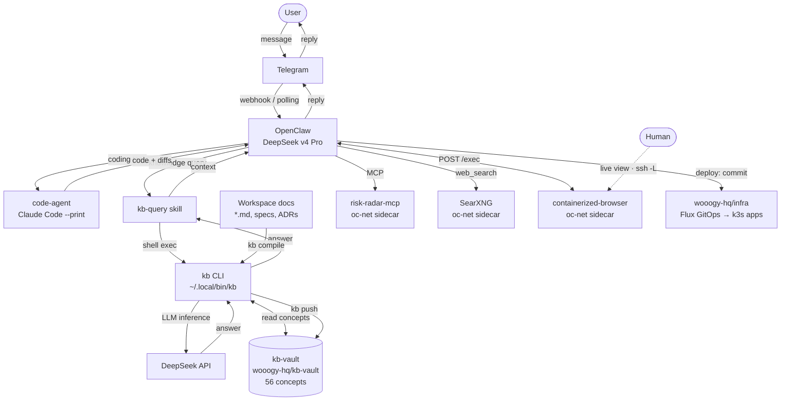

# openclaw-host

Standalone, machine-resident **OpenClaw** runtime with **S3 state sync**.

Turn any machine (home server, VPS, spare box) into an always-on OpenClaw agent
host that runs OpenClaw's **native channels** (Telegram, …) and mirrors its
workspace + session state to the **same S3 bucket** used by a
[`serverless-openclaw`](https://github.com/serithemage/serverless-openclaw)
deployment — so state is shared across the machine and the serverless web/Telegram
paths.

> Status: core runtime implemented (config, S3 sync, gateway supervisor,
> lifecycle) with 41 passing tests. Design in [`docs/spec.md`](docs/spec.md).
> Pending: live smoke test on a real machine with a Telegram bot token.

> 💸 **Cost lesson learned the hard way.** The periodic S3 backup originally
> re-uploaded the *entire* workspace every cycle with no change detection. Once
> the agent had cloned a handful of repos into its workspace, that workspace was
> ~32k files — **~85% of them `node_modules/` + `.git/`** — and the backup ran
> nonstop, generating **~4.5M S3 PUT/LIST requests per day (~$20/day, an AWS Cost
> Anomaly alert)**, growing with every new clone. Real bill, real pain. Fixed in
> [`src/s3-sync.ts`](src/s3-sync.ts): (1) skip `node_modules`/`.git`/build caches
> **and any nested git repo** (clones live on their remote — back up only the
> agent's own core state), and (2) **incremental** upload via a size+mtime
> manifest so idle cycles do **zero** PUTs. Result: ~4.5M → ~660k → near-zero
> requests/day. If you fork this, keep your workspace backup lean and never
> mirror reconstructible junk to S3.

## Quick start (local)

```bash
git clone git@github.com:SeungWookHan/openclaw-host.git
cd openclaw-host
cp .env.example .env   # set DATA_BUCKET, USER_ID, AWS_REGION, TELEGRAM_BOT_TOKEN, AI_PROVIDER...
npm install
npm run build
npm start              # restore from S3 -> write openclaw.json -> run `openclaw gateway run`
```

Requires the `openclaw` CLI on PATH (`npm i -g openclaw@2026.5.28` — see the version
pin warning below), or point
`OPENCLAW_BIN` at a specific binary.

## Run as a service ("like an OS")

The agent owns host directories of files/projects (files scope — full control
inside the container, host reach limited to the mounted dirs; no host
services/packages/docker). Two equivalent paths:

**`run.sh` — the primary deploy on the home server.** Builds the image and
(re)runs the container with bind-mounted workspace/state/skills:

```bash
bash run.sh                 # docker build + graceful stop -t 150 + docker run
docker logs -f openclaw-host
```

**docker compose — the declarative equivalent of `run.sh`** (same container
name, bind paths, env, and uid), so either tool attaches to the *same* state
without loss:

```bash
docker compose up -d --build      # override paths via HOST_WORKSPACE / HOST_STATE / HOST_SKILLS
docker compose logs -f
```

See [`run.sh`](run.sh) / [`docker-compose.yml`](docker-compose.yml) for the exact
mounts (`/data/workspace`, `/state`, `/skills`), `HOME=/state`, and AWS-credential
options, or run via systemd — see [`deploy/openclaw-host.service`](deploy/openclaw-host.service).

**Scope note:** the agent runs commands *inside the container*. Mounting a host
dir lets it manage those files, but not host services/packages. To let it
administer the host itself, you'd add host access (privileged / `--pid=host` /
docker socket) — deliberately, since that makes the container effectively root
on the box.

## Configuration

All config is via environment variables — see [`.env.example`](.env.example).
Secrets (bot token, AI API key) are delivered via env only and are **never**
written into `openclaw.json`.

`OPENCLAW_GATEWAY_TOKEN` (required) authenticates the agent + `openclaw cron` to the
gateway websocket.

> `openclaw.json` is regenerated from env on every boot (runtime-added keys like
> `mcp` are preserved by a merge). ⚠️ **Keep OpenClaw pinned to `2026.5.28`** — `2026.6.1`
> has a Telegram ingress regression that silently drops inbound DMs
> ([#86957](https://github.com/openclaw/openclaw/issues/86957)). For this and other
> failures (vanishing MCP, lost state, gateway auth), see
> [`docs/troubleshooting.md`](docs/troubleshooting.md).

## Skills (runtime install, no redeploy)

The coding delegate runs Claude Code headless (`claude -p`), where the interactive
`/plugin install` REPL doesn't exist. Instead, skill **plugins** are loaded from
disk via `--plugin-dir`:

- **Baked-in default:** [`addyosmani/agent-skills`](https://github.com/addyosmani/agent-skills)
  is cloned into `/opt/agent-skills` at build time, giving the agent
  `/spec /plan /build /test /review /ship`. Pin a version with the
  `AGENT_SKILLS_REF` build arg.
- **Runtime, agent-installed:** the agent (or you) can add more plugins **without a
  rebuild or redeploy** using the `install-skill` helper. Plugins land in the
  persisted `/skills` volume (`openclaw-skills`) and survive restarts; `code-agent`
  auto-loads every plugin found there on each run.

```bash
install-skill add <owner/repo> [name]   # git-clone a plugin repo into /skills
install-skill list                       # list installed plugins
install-skill update [name]              # git pull (all, or one)
install-skill remove <name>
```

A plugin repo must contain `.claude-plugin/plugin.json`. The agent learns this
workflow from its workspace `AGENTS.md` / `TOOLS.md`. Disable plugin loading with
`CODE_AGENT_NO_PLUGINS=1`, or force a single dir with `CLAUDE_PLUGIN_DIR`.

## MCP servers

OpenClaw speaks MCP natively (`openclaw mcp add|list|probe|reload`). Two cases:

- **Remote / hosted MCP** — nothing to run; register the URL:
  ```bash
  docker exec openclaw-host openclaw mcp add <name> --transport streamable-http --url <https-url>
  ```
- **Self-hosted MCP** — the agent container is **Node-only** (no Python/uv, no
  docker socket), so a self-hosted server runs as its own **sidecar container** on
  the shared `oc-net` network and the agent connects by container name. Build/run it
  with the generic [`run-mcp-sidecar.sh`](run-mcp-sidecar.sh), then register it:
  ```bash
  ./run-mcp-sidecar.sh <container-name> <owner/repo> [-- <extra docker run args>]
  docker exec openclaw-host openclaw mcp add <name> --transport streamable-http --url http://<container-name>:<port>/mcp
  docker exec openclaw-host openclaw mcp reload
  ```

`run.sh` creates `oc-net` and keeps openclaw-host attached across redeploys; the
registration persists via the openclaw.json merge (see
[`docs/troubleshooting.md`](docs/troubleshooting.md)). For a concrete, runnable
example see [`examples/mcp-sidecars/`](examples/mcp-sidecars/).

## HTTP sidecars (web search & browser)

Not everything the agent reaches is MCP. Some capabilities are plain HTTP services
the agent **curls** — wired by a URL in `.env`, no `openclaw mcp add`. They run as
their own containers on `oc-net`, declared in
[`docker-compose.sidecars.yml`](docker-compose.sidecars.yml):

```bash
docker compose -f docker-compose.sidecars.yml up -d   # searxng + containerized-browser on oc-net
```

| sidecar | the agent uses it for | wired by | notes |
|---|---|---|---|
| **SearXNG** (`searxng/searxng`) | the built-in `web_search` tool | `SEARXNG_BASE_URL=http://searxng:8080` | without it `web_search` fails *"SearXNG base URL is not configured"*. `settings.yml` must enable `search.formats: [html, json]` — see [`examples/sidecars/searxng-settings.yml`](examples/sidecars/searxng-settings.yml). |
| **containerized-browser** ([repo](https://github.com/unknownpgr/containerized-browser)) | JS-rendered pages, interaction, screenshots — a **live human-watchable** Chromium | `BROWSER_URL=http://containerized-browser:8080` + `BROWSER_PASSWORD` | agent drives it via `POST /exec` (it reads `GET /guide` first). Human watches `/` via `ssh -L 8080:localhost:8080 <host>`. ⚠️ `/exec` is arbitrary code-exec reachable on oc-net — don't expose the viewer publicly without a gate (Cloudflare Access / Traefik basic-auth). |

After starting a sidecar, set its env var(s) in `.env` and `bash run.sh` so the
agent picks them up. The agent learns to *use* the browser from its workspace
`AGENTS.md` / `guides/BROWSER.md`.

## Architecture



The agent's own capabilities are extended by **oc-net sidecars** (MCP servers like
`risk-radar-mcp`, plus the HTTP services above) — and it ships product apps to the
k3s cluster by committing to [`wooogy-hq/infra`](https://github.com/wooogy-hq/infra)
(Flux reconciles them). See [`guides/DEPLOY.md`] in the agent workspace.

## Knowledge Base Integration

The agent uses [`kb`](https://github.com/wooogy-hq/kb-vault) — a local CLI
knowledge-base tool — to answer questions from a curated vault of 56 concepts
maintained in [`wooogy-hq/kb-vault`](https://github.com/wooogy-hq/kb-vault).

**Components**

| Component | Role |
|---|---|
| `kb` binary (`~/.local/bin/kb`) | CLI that reads the vault and queries DeepSeek for LLM-assisted lookups |
| `kb-vault` (GitHub) | Version-controlled set of Markdown concept files; the source of truth |
| `kb-query` OpenClaw skill | Exposes `kb` to the running agent so it can call it mid-conversation |
| DeepSeek API | LLM backend used by `kb` for semantic search and synthesis |

**How it works**

1. The agent receives a question that needs domain context (architecture decisions,
   project conventions, known patterns).
2. It calls the `kb-query` skill, which shells out to `kb query <question>`.
3. `kb` looks up relevant concepts from the local clone of `kb-vault` and, if
   needed, sends them plus the question to DeepSeek to synthesize an answer.
4. The answer is returned to the agent as context before it composes its reply.

**Keeping the vault up to date**

Workspace documentation (specs, ADRs, how-tos) is compiled into the vault:

```bash
kb compile docs/          # parse workspace Markdown into concept files
kb push                   # push updated concepts to wooogy-hq/kb-vault on GitHub
```

This keeps the agent's knowledge current with the project without bloating the
system prompt.

## What it is / isn't

- **Is:** OpenClaw process supervisor + S3 workspace/session sync. Native channels
  (Telegram in v1) — OpenClaw talks to chat platforms directly.
- **Isn't:** a serverless stack. No API Gateway, Lambda, DynamoDB, or Bridge.

State is shared with a `serverless-openclaw` deployment through the same S3
bucket: `workspaces/{userId}/...` and `sessions/{userId}/agents/default/sessions/...`.
See [`docs/spec.md`](docs/spec.md) for the full architecture, S3 layout contract,
and boundaries.
