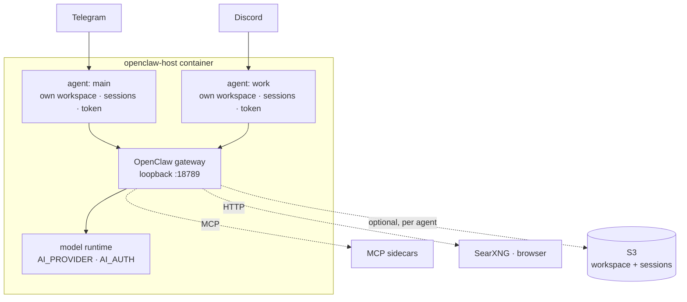

# openclaw-host

Run [OpenClaw](https://docs.openclaw.ai) as an always-on service on hardware you
own. A home server, a VPS, the spare laptop in a drawer. You get its native chat
channels, several isolated agents, and a config layer that keeps working when
OpenClaw changes shape underneath you.

```bash
git clone git@github.com:wooogy-hq/openclaw-host.git
cd openclaw-host && cp .env.example .env
bash run.sh
```

## Why this exists

OpenClaw already installs itself as a service. `openclaw daemon install` gives
you systemd, there is an official Docker image, and for most people that is the
end of the story. Use those.

Three things pushed me past them.

**The config stopped being reproducible.** OpenClaw configures itself through an
interactive wizard that writes `openclaw.json`. That file then drifts. Six weeks
later you cannot say which of its keys you chose, which the wizard guessed, and
which some `doctor` run repaired while you were asleep. This host builds the
whole file from environment variables on every boot, so `.env` is the only thing
you edit and the only thing you back up.

**A version bump bricked the gateway.** OpenClaw 2026.8.1 renamed the agent
roster from `agents.list` to `agents.entries`. Both directions are hard errors:
the old gateway rejects the new key, the new gateway rejects the old one. The
official answer is `openclaw doctor --fix`, which asks you to confirm. Inside a
container nobody is there to answer, and `--non-interactive` skips exactly those
migrations. So the host reads `openclaw --version` at boot and writes the shape
that version accepts, in either direction. Upgrading is a rebuild. Rolling back
is another rebuild.

**Two agents shared one GitHub token.** I run a personal agent on Telegram and a
work agent on Discord that colleagues can talk to. OpenClaw isolates their
workspaces, sessions and model credentials, but git sees one token. Ask for a
repo path and you get whatever that token can reach. Here a credential helper
picks the token from the working directory the caller sits in, so the work agent
cannot read a personal repo by naming it.

If none of those bite you, `openclaw daemon install` is less machinery between
you and upstream.

## How it fits together



[`src/index.ts`](src/index.ts) runs the lifecycle: read the gateway version,
restore from S3, write `openclaw.json`, supervise `openclaw gateway run`, back
up on a timer and at shutdown. [`src/openclaw-compat.ts`](src/openclaw-compat.ts)
holds the version differences. [`src/host.ts`](src/host.ts) decides what a
backup covers.

## Setting it up

Fill in `.env`. Every setting lives there, including the paths `run.sh` and
`docker-compose.yml` both read, so the two tools never disagree about where your
state lives.

```bash
DATA_BUCKET=my-bucket          # or BACKUP_ENABLED=false to stay machine-local
USER_ID=me
TELEGRAM_BOT_TOKEN=…
AI_PROVIDER=openai             # anthropic | bedrock | deepseek | openai | custom
AI_AUTH=oauth                  # key | oauth | aws-sdk
HOST_WORKSPACE=/srv/oc/workspace   # defaults to $HOME/openclaw-workspace
```

Then `bash run.sh`. It builds the image, stops the old container with a 150
second grace period so the final backup finishes, and starts the new one.
[`docker-compose.yml`](docker-compose.yml) does the same declaratively, and
[`deploy/`](deploy/) has a systemd unit for running outside Docker.

The agent runs commands inside the container. It can edit anything under a
mounted host directory and cannot reach host services, packages or Docker.
Opening that up (privileged, `--pid=host`, the docker socket) makes the
container root on your box, so decide before you do it.

### Adding a second agent

```bash
openclaw agents add work --workspace /data/workspace-work
openclaw agents bind --agent work --bind discord
```

Set `HOST_WORKSPACE_WORK` in `.env` first. `/data` belongs to root inside the
image, so an agent whose workspace has no bind mount cannot write and dies with
the container. The binding also does nothing until the gateway restarts. Both
traps, and the hours they cost, are in
[`docs/troubleshooting.md`](docs/troubleshooting.md).

### Picking a model

`AI_PROVIDER=openai` with `AI_AUTH=oauth` runs turns through OpenClaw's bundled
Codex app-server on a ChatGPT subscription rather than per-token API billing:

```bash
openclaw models auth login --provider openai --device-code
```

Credentials stay in the per-agent auth store. They never reach `openclaw.json`
and never reach S3.

> Two profiles for one provider with no order set makes OpenClaw round-robin
> between them, including through one whose quota ran out. Pin it:
> `openclaw models auth order set --agent <id> --provider openai <profile…>`

### Giving the agent more to work with

| | how | what to know |
|---|---|---|
| **Skills** | `install-skill add <owner/repo>` | Installs into the persisted `/skills` volume. No rebuild. Needs `.claude-plugin/plugin.json`. |
| **Remote MCP** | `openclaw mcp add <name> --transport streamable-http --url <url>` | Nothing runs locally. |
| **Self-hosted MCP** | [`run-mcp-sidecar.sh`](run-mcp-sidecar.sh) | The agent container ships Node and nothing else, so servers run as sidecars on the `oc-net` network and answer by container name. Working example in [`examples/mcp-sidecars/`](examples/mcp-sidecars/). |
| **Web search** | `SEARXNG_BASE_URL=http://searxng:8080` | Backs the built-in `web_search` tool. Enable `search.formats: [html, json]` in `settings.yml` or every search fails. |
| **Browser** | `BROWSER_URL=…` + `BROWSER_PASSWORD` | JS-rendered pages, screenshots, and a viewer a human can watch. The profile survives restarts in a named volume, so you log into a site once and the agent reuses that session instead of holding your password. `/exec` runs arbitrary code on `oc-net`, so keep the viewer behind a gate. |

## Upgrading OpenClaw

Bump `OPENCLAW_VERSION` in `.env`, rebuild, restart. The host reshapes
`openclaw.json` for whatever version it finds and logs every change it made.
Crossing into 2026.9 also needs a newer Node base image, because OpenClaw now
refuses to install on Node 22.

[`docs/versions.md`](docs/versions.md) lists what moved between releases, which
differences are real, and which two look real and are not. CI proves it: one job
installs `openclaw@latest`, runs a 2026.7-shaped fixture through the compat
layer, and makes the actual binary validate the result. When upstream changes
shape again, that job fails here instead of at your gateway's next boot.

Session transcripts moved into per-agent SQLite in 2026.8.1. That file also
holds the OAuth store, so file-level session sync would push refresh
credentials to S3. The host drops session prefixes on those versions, says so at
startup, and points you at `openclaw backup sqlite`.

## How it compares

Most of the field is small. Every project below including this one has fewer
stars than a weekend toy, so read the table for shape rather than popularity.

| | What it is | Pick it when |
|---|---|---|
| [`openclaw daemon install`](https://docs.openclaw.ai/cli/gateway) | OpenClaw's own systemd/launchd installer | You set it up once by hand and leave it. **Start here.** |
| [Official Docker image](https://docs.openclaw.ai/install/docker) | Upstream container and compose files | You want a container and the interactive wizard suits you |
| [Railway template](https://railway.com/deploy/openclaw-prev-clawdbot-moltbot-self-host), Coolify, Elest.io | One-click PaaS with a web setup wizard | You would rather not own a machine |
| **openclaw-host** | Env-driven container around the same gateway | Your config has to be reproducible, several agents need separate credentials, and you expect to move across OpenClaw versions |
| [AgentDock](https://github.com/yuklcool/agentdock) | Platform for running any agent 24/7: sandboxes, scheduling, live streaming, pluggable brains | You want a product with a UI, and you are not committed to OpenClaw |
| [AgentOS Docker](https://github.com/thaqiif/agentos-docker) | Mobile-first web UI for Claude Code, Codex and OpenCode | You drive coding agents from your phone |
| [virtual-engineer](https://github.com/savoirfairelinux/virtual-engineer) | Ticket-driven coding and review in isolated containers | Your workflow starts from a ticket queue |
| `serverless-openclaw` | AWS Lambda and API Gateway | You want no always-on machine |

Against the built-in service specifically:

| | `daemon` / official Docker | openclaw-host |
|---|---|---|
| Always-on, restarts on crash | yes | yes |
| Interactive onboarding | once, required | never. `openclaw.json` comes from env every boot |
| Version bump or rollback | `doctor --fix` prompts, `--non-interactive` skips the config-shape migrations a container cannot answer | written for the installed version, both directions |
| Per-agent credentials | model auth per agent, git and GitHub shared | git tokens routed by working directory |
| State off the machine | `openclaw backup`: git repos, SQLite snapshots | that, plus S3 mirroring a `serverless-openclaw` deployment can share |
| Search and browser sidecars | wire them yourself | declared, with the failure modes written down |
| Official support | yes | no. One person's home server, MIT, no warranty |

## Status

Running in production on a home server: Telegram and Discord, three isolated
agents, 111 tests, CI green. The design lives in [`docs/spec.md`](docs/spec.md).
Failures that cost me real hours, including a $20/day S3 bill from a backup with
no change detection, live in [`docs/troubleshooting.md`](docs/troubleshooting.md).

## License

MIT. See [`LICENSE`](LICENSE).
