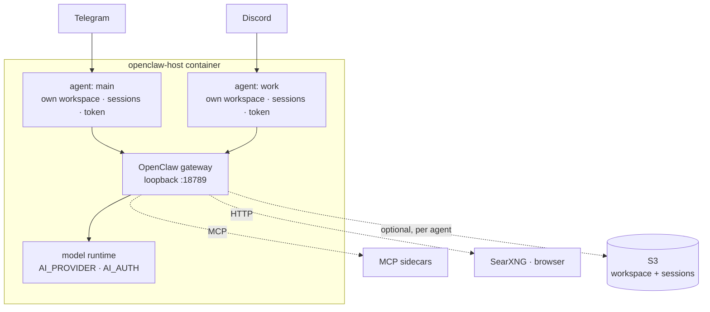

# openclaw-host

> 한국어: [`README.ko.md`](README.ko.md)

Run [OpenClaw](https://docs.openclaw.ai) as an always-on service on a machine you
own — home server, VPS, spare box — with its native chat channels, several
isolated agents, and optional S3 state sync.

The part you probably can't get elsewhere: **it emits the config shape the
installed OpenClaw version accepts.** OpenClaw 2026.8.1 ("2.0") changed that
shape in ways that are hard errors in *both* directions, so a version bump or a
rollback otherwise lands as a gateway that won't start. This host reads
`openclaw --version` at boot and adapts. See [`docs/versions.md`](docs/versions.md).

> Status: running in production on a home server — Telegram + Discord, three
> isolated agents, 111 passing tests, CI green. Design in [`docs/spec.md`](docs/spec.md).
> The failures that cost real time — including a **$20/day S3 bill** from a
> backup with no change detection — are in
> [`docs/troubleshooting.md`](docs/troubleshooting.md).

## Run it

```bash
git clone git@github.com:wooogy-hq/openclaw-host.git
cd openclaw-host
cp .env.example .env      # DATA_BUCKET, USER_ID, TELEGRAM_BOT_TOKEN, AI_PROVIDER, …
bash run.sh               # docker build + graceful stop + docker run
docker logs -f openclaw-host
```

Paths, uid and build args all come from `.env`, defaulting under `$HOME`
(`HOST_WORKSPACE`, `HOST_STATE`, `HOST_SKILLS`, …). `run.sh` and
[`docker-compose.yml`](docker-compose.yml) read the same file on purpose — they
must agree on where state lives, or switching between them forks your agent's
history. [`deploy/`](deploy/) has a systemd unit.

To run it outside Docker: `npm install && npm run build && npm start`, with the
`openclaw` CLI on PATH or `OPENCLAW_BIN` pointing at it.

**Scope.** The agent runs commands *inside the container*. A mounted host
directory is fully editable; host services, packages and Docker are not
reachable. Granting that (privileged, `--pid=host`, docker socket) makes the
container effectively root on the box — do it deliberately or not at all.

## Configuration

Everything is environment variables — see [`.env.example`](.env.example).
Secrets are delivered by env only and are **never** written into `openclaw.json`.

`openclaw.json` is regenerated on every boot: `gateway`, `channels` and `agents`
are host-owned, everything else (`mcp`, `bindings`, `auth`) survives a shallow
merge. So `openclaw agents add` persists, while `openclaw channels add` is
overwritten on the next boot and has to come from env instead.

> ⚠️ `OPENCLAW_VERSION` in the [`Dockerfile`](Dockerfile) is pinned deliberately.
> Every bump in this repo's history fixed a specific breakage. The host adapts
> the config shape across versions, but the pin is still where you choose which
> gateway you're running — read [`docs/versions.md`](docs/versions.md) first.

## Agents & channels

One gateway, N **isolated agents** — each with its own workspace, session
history, identity and GitHub token. Channels route to agents by binding:

```bash
openclaw agents add work --workspace /data/workspace-work
openclaw agents bind --agent work --bind discord   # discord → work; telegram stays on the default
```

Two things bite, both in [`docs/troubleshooting.md`](docs/troubleshooting.md): a
binding does nothing until the gateway restarts, and the new workspace must be a
host bind mount in `run.sh`.

**Credentials are isolated per agent, by working directory.** Each agent owns a
workspace tree, and git runs its credential helper with the cwd inside that tree
— so [`bin/git-credential-oc`](bin/git-credential-oc) picks the token from
*where the caller is*, not from what it asked for. An agent cannot obtain another
agent's token by requesting that org's repo path. REST calls have no
credential-helper hook, so [`bin/gh-api`](bin/gh-api) applies the same routing.

## Provider & model

`AI_PROVIDER` picks the brain — `anthropic`, `bedrock`, `deepseek`, `openai`, or
any other value for a custom OpenAI/Anthropic-compatible endpoint described by
env (`AI_BASE_URL` + `AI_MODEL` + `AI_OPENCLAW_API`). `AI_AUTH` picks how it
authenticates: `key`, `oauth`, or `aws-sdk`.

`AI_PROVIDER=openai` with `AI_AUTH=oauth` runs turns through OpenClaw's bundled
Codex app-server on a ChatGPT-subscription profile
(`openclaw models auth login --provider openai --device-code`) instead of
per-token API billing. Credentials live in the per-agent auth store — never in
`openclaw.json`, never in S3.

> With two profiles for one provider and no explicit order, OpenClaw
> **round-robins** between them, including through one whose quota is spent. Pin
> it: `openclaw models auth order set --agent <id> --provider openai <profile…>`.

## Extending

| | how | notes |
|---|---|---|
| **Skills** | `install-skill add <owner/repo>` | Lands in the persisted `/skills` volume — no rebuild, no redeploy. Needs `.claude-plugin/plugin.json`. |
| **Remote MCP** | `openclaw mcp add <name> --transport streamable-http --url <url>` | Nothing to run locally. |
| **Self-hosted MCP** | [`run-mcp-sidecar.sh`](run-mcp-sidecar.sh) | The agent container is Node-only, so servers run as sidecars on the shared `oc-net` network and are reached by container name. Example: [`examples/mcp-sidecars/`](examples/mcp-sidecars/). |
| **Web search** | `SEARXNG_BASE_URL=http://searxng:8080` | Backs the built-in `web_search` tool. `settings.yml` must enable `search.formats: [html, json]`. |
| **Browser** | `BROWSER_URL=…` + `BROWSER_PASSWORD` | JS-rendered pages and screenshots, live-watchable. Profile persists in a named volume, so a human logs in once and the agent reuses the session — better than handing it credentials. ⚠️ `/exec` is arbitrary code execution on `oc-net`; never expose the viewer publicly ungated. |

Sidecars are declared in
[`docker-compose.sidecars.yml`](docker-compose.sidecars.yml). Set the env var,
re-run `run.sh`, and the agent picks it up.

## Architecture



`src/index.ts` is the lifecycle: detect the gateway version, restore from S3,
write `openclaw.json`, supervise `openclaw gateway run`, back up on a timer and
on shutdown. [`src/openclaw-compat.ts`](src/openclaw-compat.ts) owns the version
differences; [`src/host.ts`](src/host.ts) owns what gets backed up.

S3 sync is per agent and derived from the agent directories on disk, so a new
agent needs no code change. The provider auth store sits beside those directories
and is deliberately **never** uploaded. `BACKUP_ENABLED=false` makes the host
purely machine-local.

> From OpenClaw 2026.8.1, transcripts move into per-agent SQLite that also holds
> the OAuth store, so file-level session sync stops being possible without
> shipping credentials. The host drops session prefixes there and says so at
> startup; use `openclaw backup sqlite` instead. Details in
> [`docs/versions.md`](docs/versions.md).

## Alternatives

OpenClaw ships its own service installer and an official container. Most people
should use those. This table is here so you can tell quickly whether you are one
of them.

| | What it is | Reach for it when |
|---|---|---|
| `openclaw daemon install` | Built-in systemd / launchd / schtasks service | You configure it once, interactively, and it stays that way. **Start here.** |
| Official Docker image | Upstream container + compose | You want a container and are happy with interactive onboarding |
| Railway template, Coolify, Elest.io | One-click PaaS with a web setup wizard | You would rather not own the machine |
| **openclaw-host** | Env-driven container around the same gateway | Config has to be reproducible from env, several agents need separate credentials, and you expect to move across OpenClaw versions |
| `serverless-openclaw` | AWS Lambda + API Gateway | You want no always-on machine at all |

What this adds over the built-in service, and what it gives up:

| | `daemon` / official Docker | openclaw-host |
|---|---|---|
| Always-on, restarts on crash | yes | yes |
| Interactive onboarding | once, required | never — `openclaw.json` is a function of env, rewritten each boot |
| OpenClaw version bump or rollback | `doctor --fix` prompts, and `--non-interactive` skips exactly the config-shape migrations a container cannot answer | emitted for the installed version, both directions, [`docs/versions.md`](docs/versions.md) |
| Per-agent credentials | model auth is per agent; git and GitHub are not | git tokens routed by working directory, so an agent cannot ask for another's |
| State off the machine | `openclaw backup` — git repos and SQLite snapshots | the same, plus S3 mirroring that a `serverless-openclaw` deployment can share |
| Search / browser sidecars | wire them yourself | declared, with the failure modes written down |
| Officially supported | yes | no — one person's home server, MIT, no warranty |

**Skip this** if `openclaw daemon install` already fits. It is the supported
path and there is less between you and upstream. The reason to be here is that
you want the config to be an artifact of your environment rather than a file
you edited once, and you would like a version bump to be a rebuild rather than
an afternoon.

## Scope

**Is:** an OpenClaw process supervisor with config generation, version
compatibility, per-agent credential isolation, and optional S3 state sync.

**Isn't:** a serverless stack. No API Gateway, Lambda, or DynamoDB.

The S3 layout in [`src/s3-contract.ts`](src/s3-contract.ts) is deliberately
compatible with a `serverless-openclaw` deployment sharing the same bucket —
`workspaces/{userId}/…` and `sessions/{userId}/agents/{agentId}/sessions/…`. If
you are not sharing a bucket with one, that contract costs you nothing: set your
own `DATA_BUCKET`, or turn backups off entirely.

## License

MIT — see [`LICENSE`](LICENSE).
