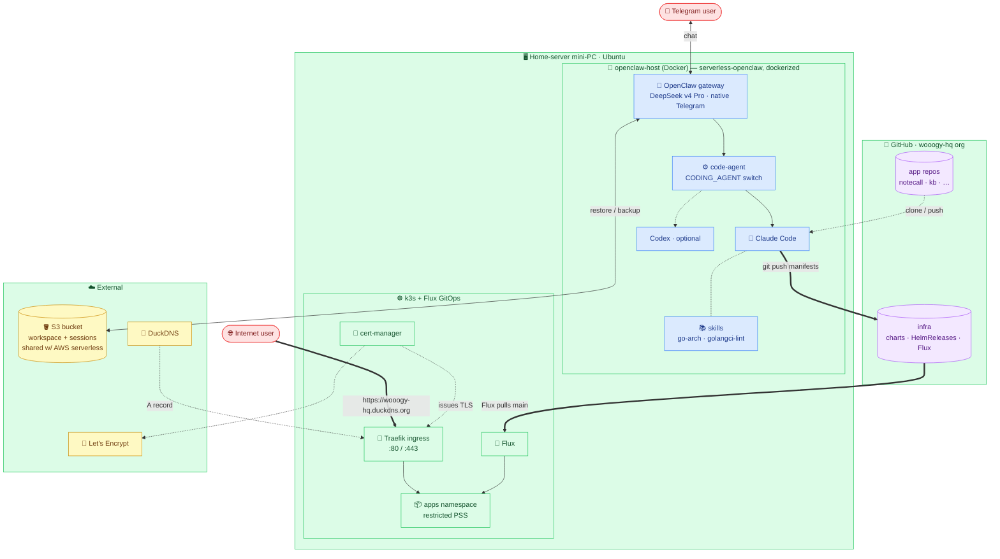
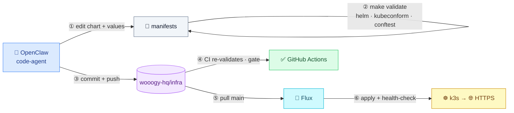

# openclaw-host — architecture

A single home-server mini-PC runs two cooperating layers:

1. **Agent layer** — `serverless-openclaw`, dockerized, running OpenClaw (DeepSeek)
   with **Claude Code** as the coding agent, state synced to S3.
2. **Platform layer** — **k3s + Flux GitOps**: the agent pushes ops manifests to
   GitHub, Flux pulls them, and apps deploy to the cluster automatically — exposed
   to the internet over HTTPS.

## System overview

## Deploy loop (GitOps — the agent never holds cluster creds)

## Key points
- **Two layers, one box.** The dockerized agent (OpenClaw + Claude Code) and the
  k3s GitOps platform run on the same mini-PC; Docker and k3s (containerd) coexist.
- **Coding → Claude Code.** OpenClaw delegates coding to a backend-agnostic
  `code-agent` (Claude Code by default, Codex via `CODING_AGENT=codex`).
- **S3 = single source of truth.** Workspace + sessions sync to the same bucket as
  the AWS serverless-openclaw deployment.
- **Deploy = git commit.** The agent never touches the cluster: it validates and
  commits manifests to `wooogy-hq/infra`; Flux reconciles them. CI + conftest +
  Flux health-checks gate every change.
- **Public HTTPS, no tunnel.** Real public IP with :80/:443 open → Traefik;
  DuckDNS for the hostname (DDNS CronJob tracks the IP); cert-manager + Let's
  Encrypt for TLS.
