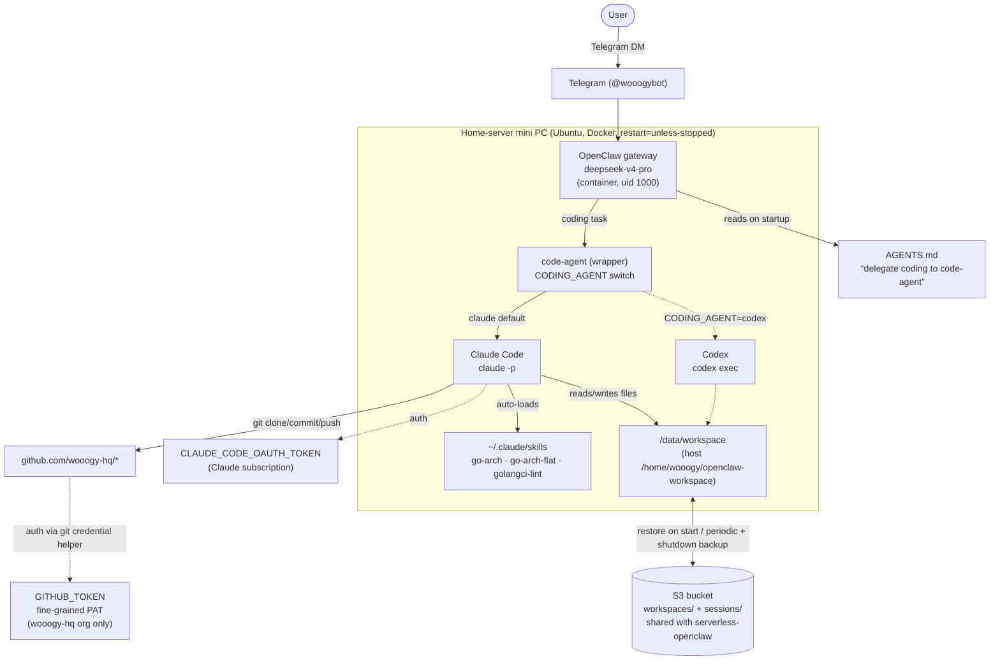

# OpenClaw ↔ Claude Code integration (home server)

How the home-server agent stack fits together: OpenClaw is the chat/orchestration
front-end; coding is delegated to a backend-agnostic `code-agent` (Claude Code by
default, Codex optional); state lives in S3; git is scoped to the `wooogy-hq` org.

## Key points
- **Two skill systems:** OpenClaw (deepseek) has its own skills; the go-arch /
  golangci-lint skills live in Claude Code's `~/.claude/skills` and apply when
  OpenClaw delegates coding to `code-agent` → `claude`.
- **Backend-agnostic coding:** `CODING_AGENT=claude|codex` swaps the coding CLI
  with no other change.
- **S3 = source of truth:** the workspace and sessions sync to the same bucket as
  the serverless deployment (one active environment at a time per user).
- **Scoped git:** the container's git uses a fine-grained PAT limited to the
  `wooogy-hq` org — it can clone/push wooogy-hq repos and nothing else.
